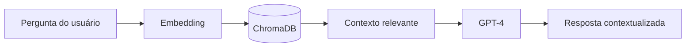

# Agente IA (Python)

:::info Em construção
Conteúdo detalhado será adicionado em breve.
:::

## Stack

- **Python 3.12+**
- **LangChain** — framework de agentes
- **ChromaDB** — vector store para RAG
- **FastAPI** — API HTTP
- **OpenAI GPT-4** — LLM

## Arquitetura RAG



## Estrutura do Projeto

```
pj-assistant-agent-py/
├── src/
│   ├── agent/          # Lógica do agente
│   ├── api/            # Endpoints FastAPI
│   ├── core/           # Config e utils
│   ├── observability/  # Logging e métricas
│   ├── rag/            # RAG engine
│   └── security/       # Autenticação
├── data/
│   ├── chroma/         # Vector store persistido
│   └── knowledge_base/ # Documentos fonte
├── docs/               # Contratos e guias
└── tests/              # Unit e integration tests
```
