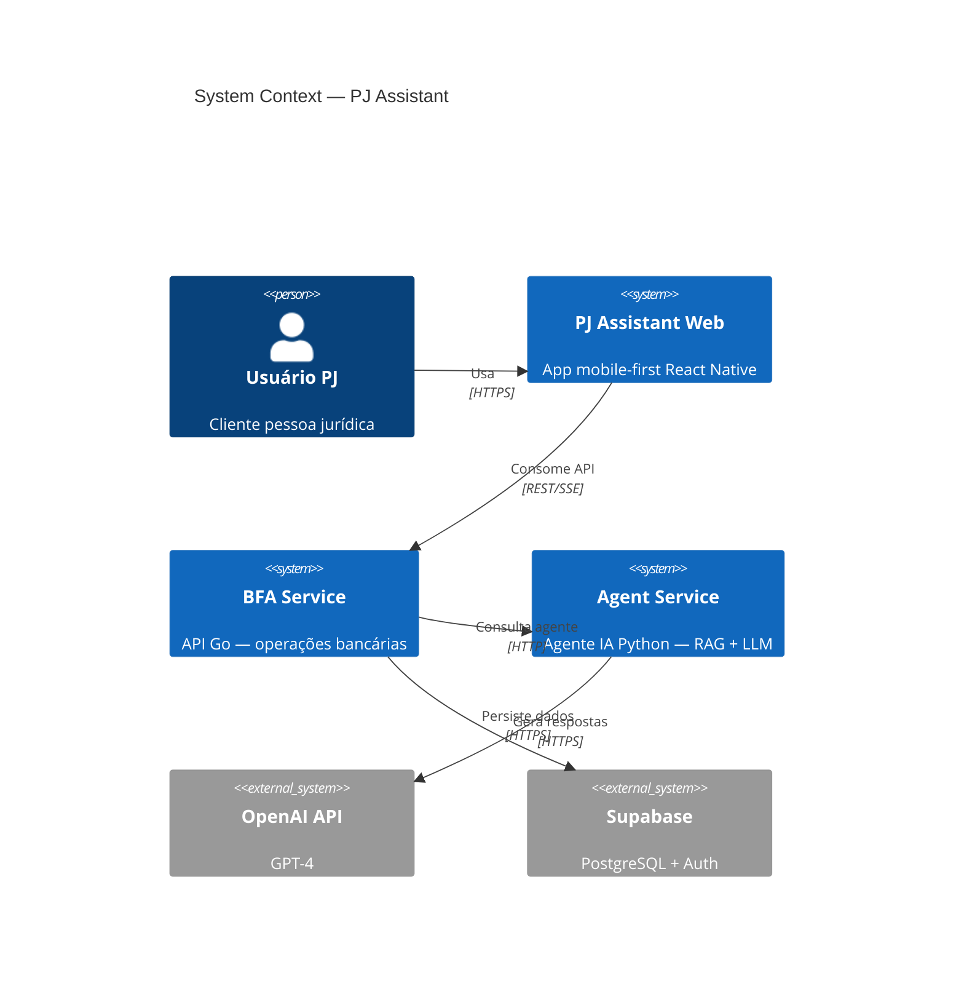
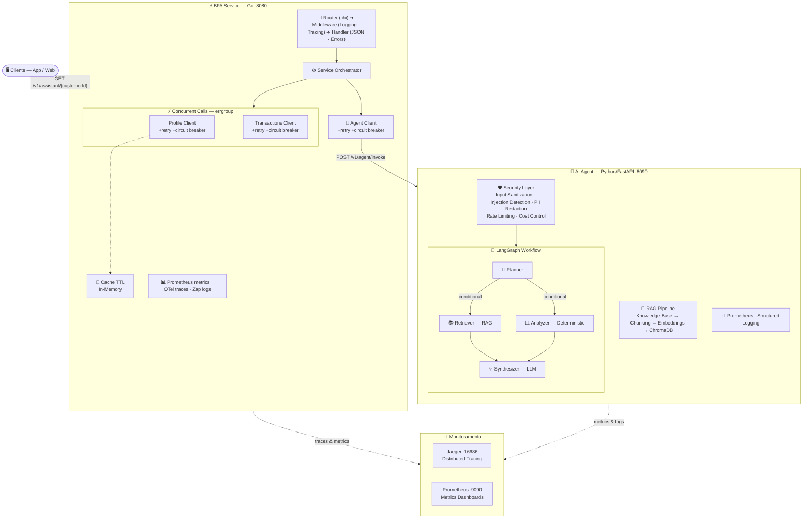
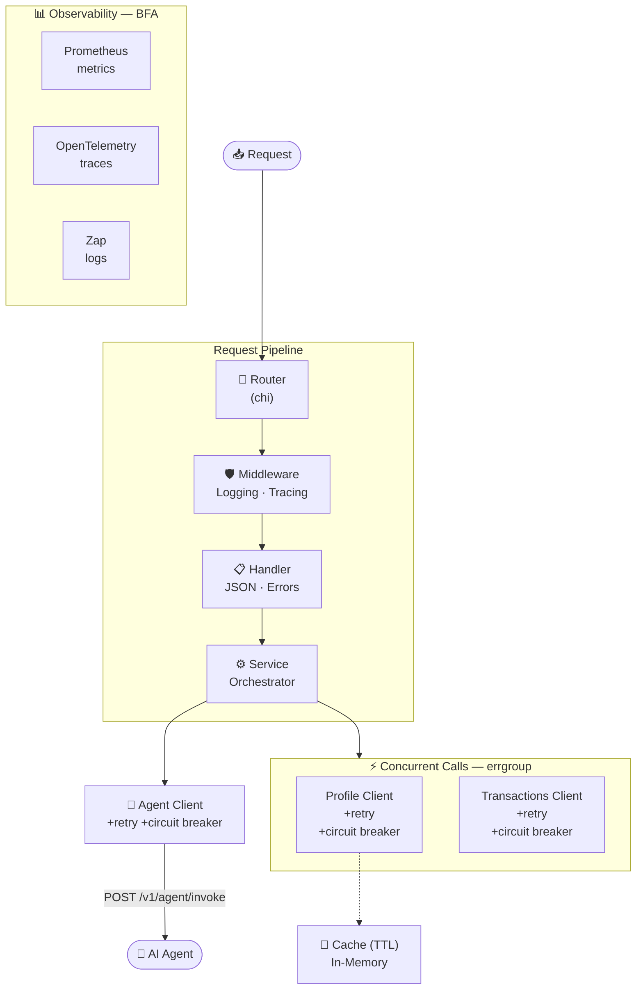
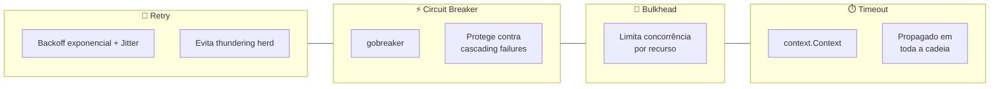
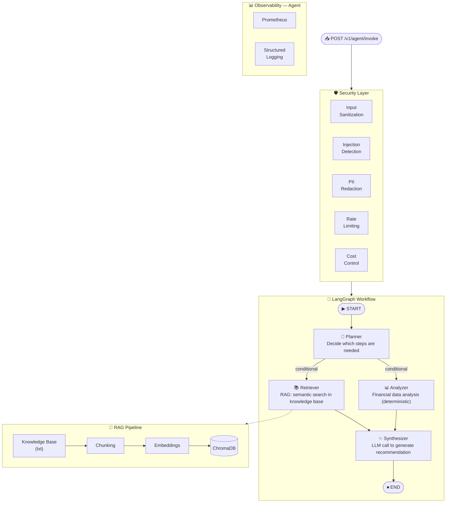
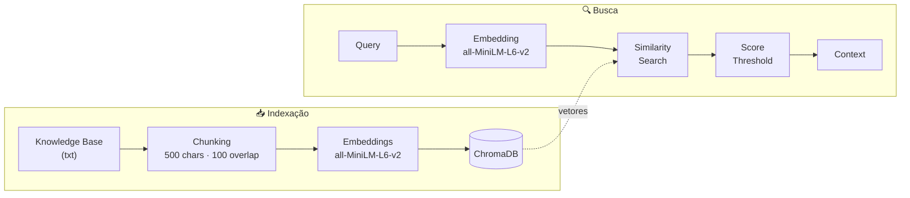
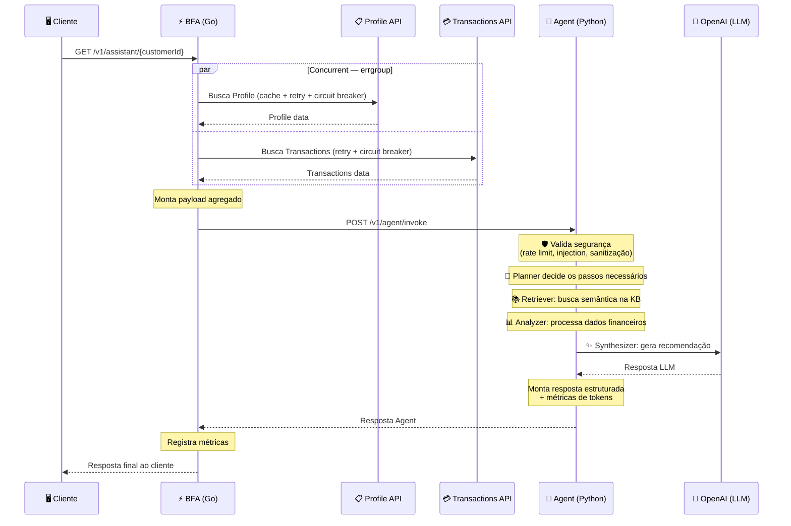
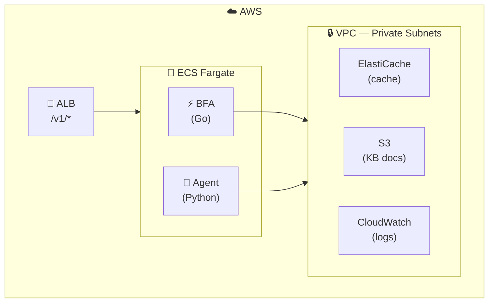

# Arquitetura da Solução

> **Separação clara entre orquestração (Go) e inteligência (Python)**, comunicando-se via contrato REST versionado. Cada camada é independente, testável e deployável isoladamente.

---

## Diagrama de Contexto (C4 — Nível 1)

Visão macro do sistema e suas dependências externas.

---

## Visão Geral da Arquitetura

Diagrama completo mostrando a camada de orquestração (BFA), a camada de inteligência (Agent) e o monitoramento.

---

## BFA (Go) — Arquitetura Interna

Camada de orquestração responsável por resiliência, roteamento e agregação de dados.

### Padrões de Resiliência

---

## AI Agent (Python) — Arquitetura Interna

Camada de inteligência responsável pelo processamento de linguagem natural, RAG e geração de recomendações.

### RAG Pipeline — Detalhe

Duas fases: **indexação** offline da base de conhecimento e **busca** em tempo de query.

:::info Detalhes técnicos do RAG
- **Chunking**: `RecursiveCharacterTextSplitter` — 500 caracteres, 100 de overlap
- **Embeddings**: `all-MiniLM-L6-v2` — leve, roda em CPU
- **Vector Store**: ChromaDB — local, sem infra adicional
- **Filtragem**: score threshold para evitar contexto irrelevante
:::

---

## Fluxo de Dados

Sequência completa de uma request do cliente até a resposta final.

---

## Decisões Arquiteturais

### Separação BFA × Agent

| Aspecto | BFA (Go) | Agent (Python) |
|---|---|---|
| **Responsabilidade** | Orquestração, resiliência, performance | Ecossistema de IA — LLM, RAG, análise |
| **Por que esta linguagem** | Go é ideal para I/O concorrente | Python tem LangChain/LangGraph, embeddings, ChromaDB |
| **Comunicação** | Expõe REST para o cliente | Recebe chamadas via contrato REST versionado |
| **Deploy** | Independente | Independente |

### Resiliência (BFA)

| Padrão | Implementação | Propósito |
|---|---|---|
| **Retry** | Backoff exponencial + jitter | Evita thundering herd |
| **Circuit Breaker** | gobreaker | Protege contra cascading failures |
| **Bulkhead** | Limita concorrência por recurso | Isolamento de falhas |
| **Timeout** | `context.Context` propagado | Controle em toda a cadeia |

### Segurança (Agent)

| Controle | Descrição |
|---|---|
| **Input Sanitization** | Sanitização de input no boundary |
| **Injection Detection** | Detecção de prompt injection via regex patterns |
| **PII Redaction** | Redação de PII na resposta |
| **Rate Limiting** | Limitação por customer |
| **Cost Control** | Controle de custo diário por customer |

---

## Estratégia de Deploy (AWS)

---

## Princípios Arquiteturais

- **Separação clara de responsabilidades** — cada serviço tem um domínio bem definido
- **API-first** — contratos definidos antes da implementação
- **Event-driven** quando possível (SSE para streaming)
- **Observabilidade** — logs estruturados, métricas, tracing
