import Tabs from '@theme/Tabs';
import TabItem from '@theme/TabItem';

# Arquitetura da Solução

> Separação clara entre **orquestração (Go)** e **inteligência (Python)**, comunicando-se via contrato REST versionado.
> Cada camada é independente, testável e deployável isoladamente.

<span class="badge badge--go">Go</span> <span class="badge badge--python">Python</span> <span class="badge badge--ai">LangGraph</span> <span class="badge badge--react">React Native</span>

---

## System Context — C4 Nível 1

<div class="diagram-zoom">

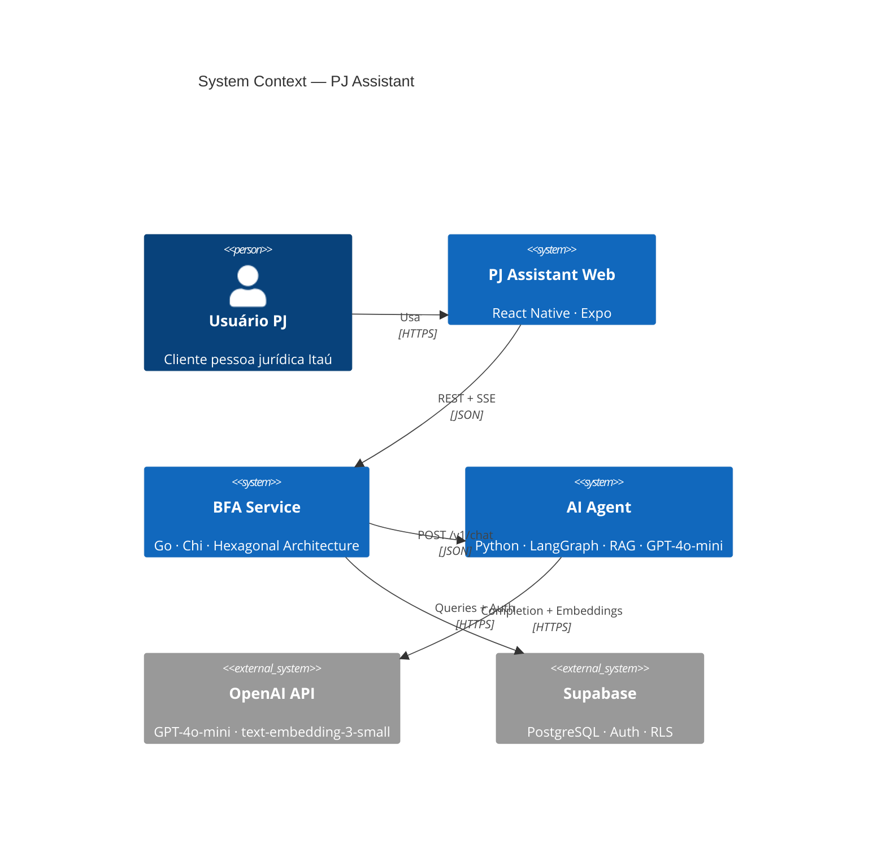

</div>

---

## Visão Geral — Orquestração + Inteligência

<div class="diagram-zoom">

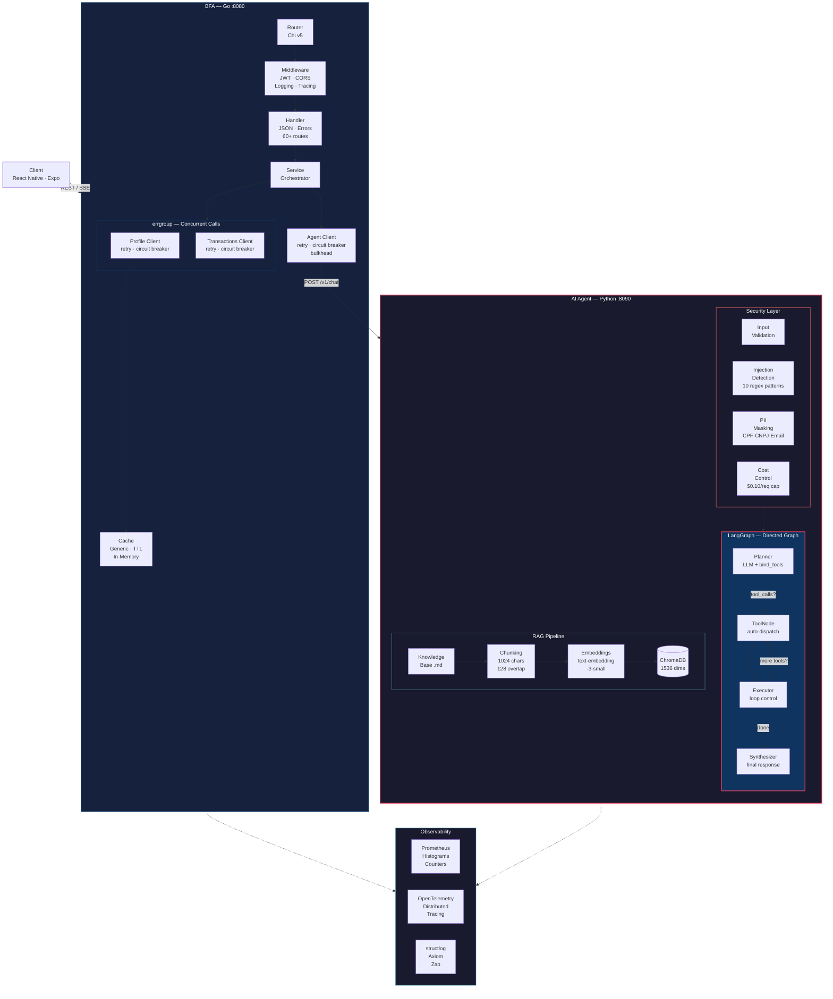

</div>

---

## AI Agent — Deep Dive {#agent-deep-dive}

:::tip Destaque
O agente é o **núcleo inteligente** do sistema — um grafo dirigido com conditional routing, multi-step tool loops, e RAG com filtragem por relevância. Zero-cost onboarding via state machine determinística.
:::

### LangGraph Workflow

O grafo implementa um **loop de planejamento-execução-síntese** com roteamento condicional. O Planner decide quais ferramentas acionar; o Executor controla o loop; o Synthesizer gera a resposta final.

<div class="diagram-zoom">

```mermaid
flowchart TB
    start(["START"])

    subgraph graph["LangGraph Directed Graph"]
        direction TB

        planner["<strong>Planner</strong>\nGPT-4o-mini · temperature 0.1\nbind_tools(3 tools)\nRecords AgentStep PLAN"]
        tools["<strong>ToolNode</strong>\nAuto-dispatches tool_calls\nReturns ToolMessage objects"]
        executor["<strong>Executor</strong>\nProcesses tool results\nRecords AgentStep TOOL_CALL\nDecides: loop or synthesize"]
        synthesizer["<strong>Synthesizer</strong>\nGenerates client-facing response\nOnboarding-aware instructions\nRecords AgentStep SYNTHESIZE"]

        planner -->|"has tool_calls"| tools
        planner -->|"no tool_calls"| synthesizer
        tools --> executor
        executor -->|"has tool_calls\n(multi-step loop)"| tools
        executor -->|"no tool_calls"| synthesizer
    end

    start --> planner
    synthesizer --> stop(["END"])

    style graph fill:#0f0f23,stroke:#e94560,stroke-width:2px,color:#fff
    style planner fill:#1a1a2e,stroke:#e94560,stroke-width:2px,color:#fff
    style tools fill:#1a1a2e,stroke:#ffd93d,stroke-width:2px,color:#fff
    style executor fill:#1a1a2e,stroke:#6bcb77,stroke-width:2px,color:#fff
    style synthesizer fill:#1a1a2e,stroke:#4d96ff,stroke-width:2px,color:#fff
    style start fill:#e94560,stroke:#e94560,color:#fff
    style stop fill:#e94560,stroke:#e94560,color:#fff
```

</div>

### Tools — Capabilities do Agente

Três ferramentas expostas ao LLM via `bind_tools`, automaticamente despachadas pelo `ToolNode`:

<div class="diagram-zoom">

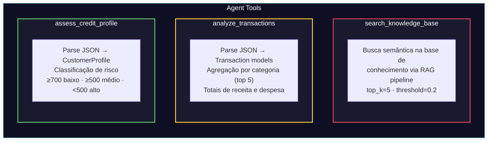

</div>

### RAG Pipeline — Indexação + Retrieval

<Tabs>
<TabItem value="diagram" label="Diagrama" default>

<div class="diagram-zoom">

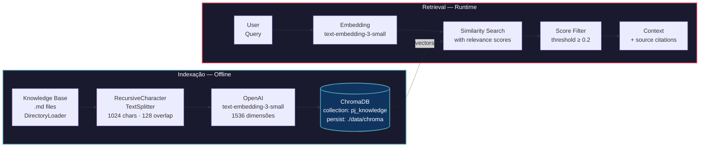

</div>

</TabItem>
<TabItem value="details" label="Detalhes Técnicos">

| Parâmetro | Valor | Rationale |
|-----------|-------|-----------|
| **Splitter** | `RecursiveCharacterTextSplitter` | Hierárquico: `\n\n` → `\n` → `. ` → ` ` |
| **Chunk size** | 1024 chars (~256 tokens) | Tabelas markdown cabem inteiras |
| **Overlap** | 128 chars (~12%) | Preserva contexto nas fronteiras |
| **Embedding model** | `text-embedding-3-small` (OpenAI) | 1536 dims, suporte nativo a português, ~$0.02/1M tokens |
| **Vector store** | ChromaDB (local, persistente) | Sem infra adicional, collection wipe antes de re-ingestion |
| **top_k** | 5 (configurável via `RAG_TOP_K`) | Balance entre recall e precisão |
| **Threshold** | 0.2 | Filtra chunks irrelevantes |
| **Anti-hallucination** | Wipe collection antes de re-ingest | Previne retrieval de chunks stale/deletados |

</TabItem>
</Tabs>

### Security — 4 Camadas de Proteção

<div class="diagram-zoom">

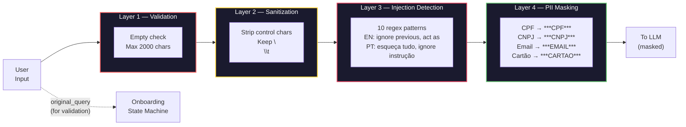

</div>

:::info Dual Query Pipeline
A `original_query` (pré-masking) é preservada para validação de dados reais no onboarding (CNPJ, CPF, email), enquanto a versão masked vai para o LLM — **dados sensíveis nunca chegam ao modelo**.
:::

### Onboarding — State Machine Determinística

Fluxo de cadastro **zero-cost** (sem chamadas ao LLM): respostas determinísticas via templates, validação em duas camadas (Agent + BFA).

<div class="diagram-zoom">

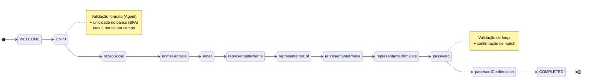

</div>

<details>
<summary><strong>Divisão de responsabilidades Agent vs BFA no onboarding</strong></summary>

| Responsabilidade | Agent (Python) | BFA (Go) |
|-----------------|----------------|----------|
| **Fluxo conversacional** | Intent detection, state machine, templates | — |
| **Validação de formato** | Regex guard rails (CPF, CNPJ, email) | — |
| **Validação de negócio** | — | Unicidade CNPJ/CPF, verificação de dígitos, idade ≥ 18 |
| **Persistência** | — | Salva campos no Supabase, controla sessão |
| **Custo** | Zero — sem chamadas LLM | Queries ao banco |
| **Override** | — | Se Agent rejeita mas BFA valida, envia `CAMPO_ACEITO_BFA` |

</details>

### LLM-as-Judge — Framework de Avaliação

<div class="diagram-zoom">

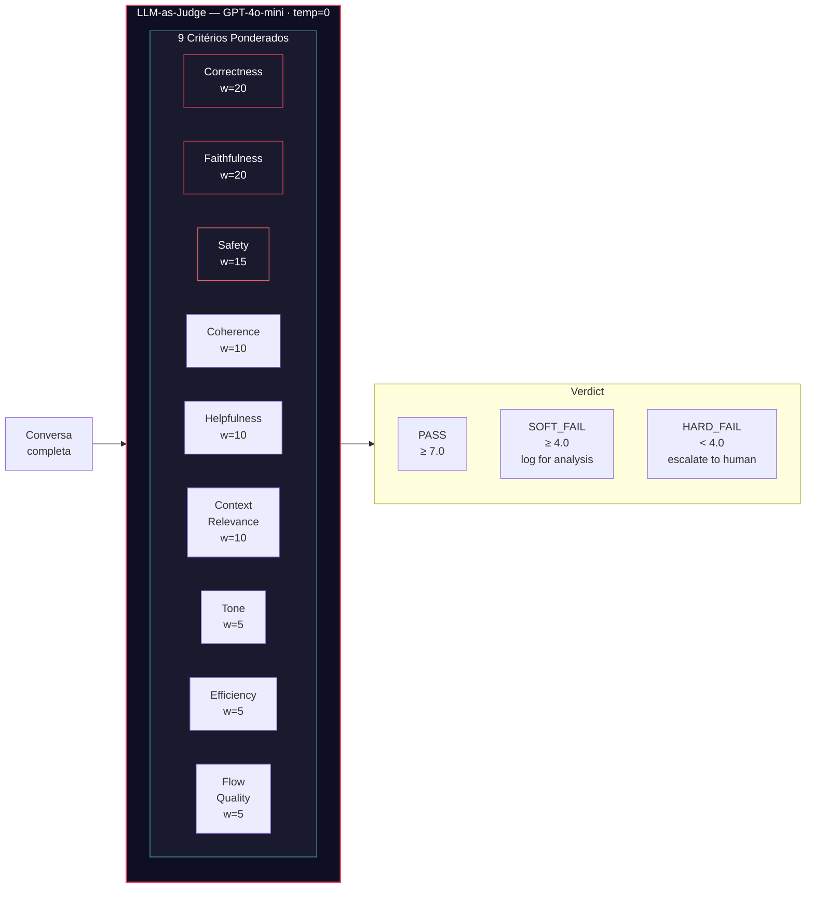

</div>

:::note Fórmula
$\text{Score} = \frac{\sum_{i=1}^{9} \text{score}_i \times \text{weight}_i}{\sum_{i=1}^{9} \text{weight}_i}$

RAG chunks são passados ao judge para avaliação de **faithfulness** e **context_relevance** — o modelo avalia se a resposta é fiel aos documentos recuperados.
:::

---

## BFA (Go) — Hexagonal Architecture

### Estrutura de Camadas

<div class="diagram-zoom">

```mermaid
flowchart TB
    subgraph ENTRY["Entry Point — cmd/bfa/main.go"]
        main["DI Wiring\nGraceful shutdown\nSignal handling"]
    end

    subgraph HANDLER["Handler Layer — HTTP"]
        direction LR
        h1["Assistant\nHandler"]
        h2["Chat\nHandler"]
        h3["Banking\nHandler"]
        h4["Auth\nHandler"]
    end

    subgraph SERVICE["Service Layer — Business Logic"]
        direction LR
        s1["Assistant\nService"]
        s2["Chat\nService"]
        s3["Banking\nService"]
        s4["Auth\nService"]
    end

    subgraph PORTS["Ports — Interfaces"]
        direction LR
        p1["ProfileFetcher"]
        p2["TransactionsFetcher"]
        p3["AgentCaller"]
        p4["Cache T any"]
        p5["BankingStore\n11 sub-interfaces"]
        p6["AuthStore"]
    end

    subgraph INFRA["Infrastructure — Adapters"]
        direction LR
        i1["Supabase\nClient"]
        i2["HTTP\nClients"]
        i3["In-Memory\nCache"]
        i4["Resilience\nretry·cb·bulkhead"]
        i5["Observability\nProm·OTel·Zap·Axiom"]
    end

    ENTRY --> HANDLER
    HANDLER --> SERVICE
    SERVICE --> PORTS
    PORTS --> INFRA

    style ENTRY fill:#16213e,stroke:#0f3460,stroke-width:2px,color:#fff
    style HANDLER fill:#16213e,stroke:#0f3460,stroke-width:2px,color:#fff
    style SERVICE fill:#16213e,stroke:#4d96ff,stroke-width:2px,color:#fff
    style PORTS fill:#1a1a2e,stroke:#ffd93d,stroke-width:2px,color:#fff
    style INFRA fill:#1a1a2e,stroke:#53a8b6,stroke-width:2px,color:#fff
```

</div>

### Resiliência — Composição de Padrões

Cada cliente externo compõe os três padrões: **Circuit Breaker** envolve **Retry**, que envolve a chamada HTTP.

<div class="diagram-zoom">

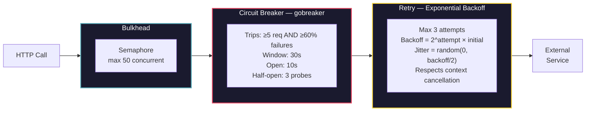

</div>

---

## Fluxo de Dados — Sequence Diagram

<div class="diagram-zoom">

```mermaid
sequenceDiagram
    autonumber

    participant C as Client
    participant B as BFA (Go)
    participant DB as Supabase
    participant A as AI Agent (Python)
    participant LLM as GPT-4o-mini

    C->>B: POST /v1/chat/{customerID}

    par errgroup — concurrent
        B->>DB: Fetch Profile (cache check first)
        DB-->>B: Profile data
    and
        B->>DB: Fetch Transactions
        DB-->>B: Transaction history
    end

    B->>A: POST /v1/chat (profile + transactions + query)

    Note over A: Security Layer<br/>validate → sanitize → detect injection → mask PII

    rect rgb(15, 15, 35)
        Note over A: LangGraph Execution

        A->>A: Planner — LLM decides tools
        A->>A: ToolNode — execute tools
        A->>A: Executor — check if more tools needed

        opt RAG needed
            A->>A: search_knowledge_base → ChromaDB
        end

        opt Financial analysis
            A->>A: analyze_transactions → aggregation
        end

        A->>LLM: Synthesizer — generate response
        LLM-->>A: Completion + token counts
    end

    A-->>B: AgentResponse (answer + sources + tokens + cost)

    Note over B: Record Prometheus metrics<br/>Save transcript (async)

    B-->>C: JSON response
```

</div>

---

## Observability Stack

<div class="diagram-zoom">

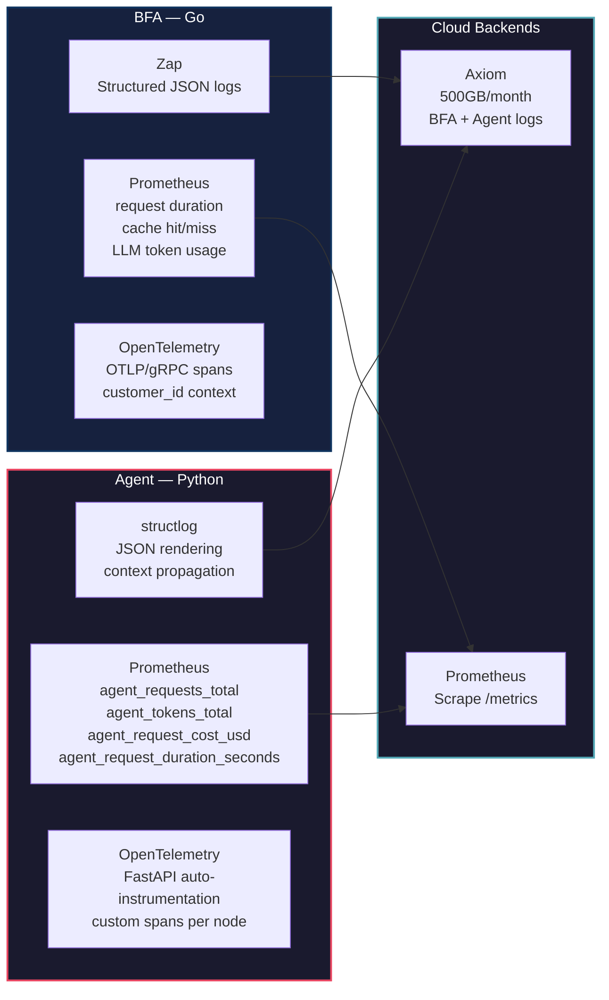

</div>

<details>
<summary><strong>Prometheus Metrics — Agent (detalhado)</strong></summary>

| Tipo | Métrica | Labels |
|------|---------|--------|
| Counter | `agent_requests_total` | `status`: success, validation_error, cost_limit, agent_error, error |
| Counter | `agent_tokens_total` | `direction`: input, output |
| Counter | `agent_tool_errors_total` | `tool_name` |
| Counter | `agent_model_errors_total` | `model` |
| Counter | `agent_fallback_total` | — |
| Histogram | `agent_request_duration_seconds` | buckets: 0.1, 0.5, 1.0, 2.0, 5.0, 10.0, 30.0 |
| Histogram | `agent_request_cost_usd` | buckets: 0.001, 0.005, 0.01, 0.05, 0.1, 0.5 |

**Estimativa de custo**: GPT-4o-mini — $0.15/1M input tokens, $0.60/1M output tokens.

</details>

---

## Decisões Arquiteturais

### Por que Go + Python?

| Aspecto | BFA — Go | Agent — Python |
|---------|----------|----------------|
| **Papel** | Orquestração, resiliência, API bancária completa | Inteligência: LLM, RAG, avaliação, NLP |
| **Justificativa** | I/O concorrente nativo, goroutines, zero GC pressure | Ecossistema de IA: LangGraph, embeddings, ChromaDB |
| **Padrão arquitetural** | Hexagonal (Ports & Adapters) | Grafo dirigido com conditional routing |
| **Comunicação** | Expõe REST+SSE para o cliente | Contrato REST versionado (`/v1/chat`) |
| **Deploy** | Container independente | Container independente |
| **Testes** | Unit + Integration | Unit + Integration + LLM-as-Judge |

### Design Patterns

| Pattern | Onde | Por quê |
|---------|------|---------|
| **Hexagonal Architecture** | BFA (Go) | Ports isolam infra do domínio; troca de backend sem tocar serviço |
| **Directed Graph** | Agent (LangGraph) | Conditional routing, multi-step tool loops, estado tipado |
| **State Machine** | Onboarding (Agent) | Zero-cost, determinístico, sem hallucination |
| **Dual Query Pipeline** | Security (Agent) | `original_query` para validação, masked para LLM |
| **Collection Wipe** | RAG Ingest (Agent) | Previne hallucination de chunks stale |
| **Facade** | `runner.py` → `run_agent()` | Desacopla API do grafo interno |
| **Generic Cache** | `Cache[T any]` (Go) | Type-safe, TTL com cleanup em goroutine |
| **Composite Interface** | `BankingStore` (Go) | Agrega 11 sub-interfaces; Supabase implementa todas |
| **META Tag Protocol** | Prompt Engineering (Agent) | LLM emite `[META:{json}]` para routing; regex-extracted e stripped antes do cliente |

### Deploy — AWS

<div class="diagram-zoom">

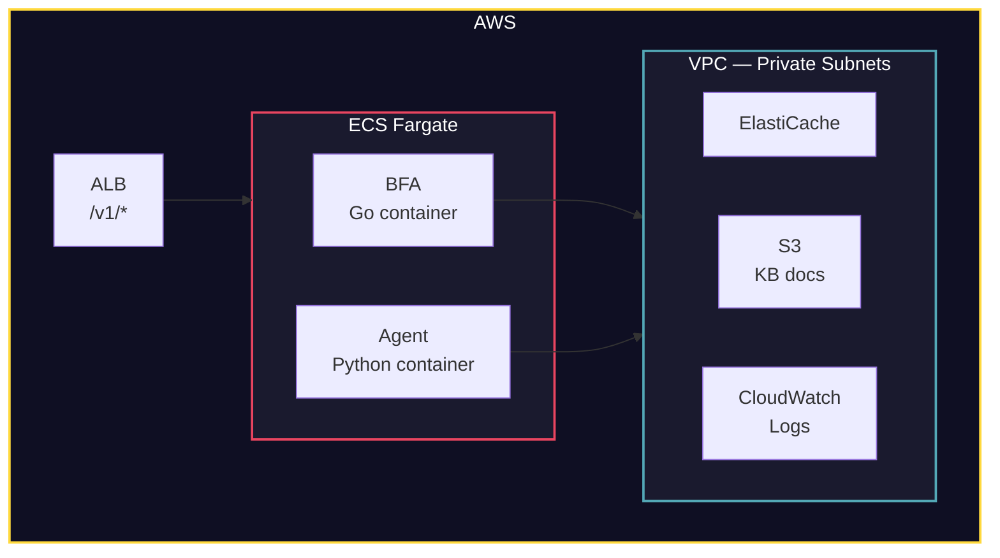

</div>

---

## Tech Stack Completa

<Tabs>
<TabItem value="agent" label="Agent (Python)" default>

| Categoria | Tecnologias |
|-----------|-------------|
| **LLM / Agent** | LangChain ≥0.3 · LangGraph ≥0.2 · langchain-openai · GPT-4o-mini |
| **RAG** | ChromaDB ≥0.5 · text-embedding-3-small (OpenAI) · RecursiveCharacterTextSplitter |
| **API** | FastAPI ≥0.115 · Uvicorn · httpx |
| **Observability** | Prometheus · OpenTelemetry · structlog · Axiom · Langfuse |
| **Security** | Input validation · Injection detection (10 patterns) · PII masking · Cost control |
| **Config** | Pydantic Settings · 12-Factor App |
| **Testes** | pytest · pytest-asyncio · pytest-cov · ruff · mypy |
| **Prompt** | Versioned (v9.0.0) · Anti-hallucination guardrails · META tag protocol |

</TabItem>
<TabItem value="bfa" label="BFA (Go)">

| Categoria | Tecnologias |
|-----------|-------------|
| **Router** | Chi v5 · CORS · JWT middleware |
| **Resiliência** | gobreaker (circuit breaker) · exponential backoff + jitter · semaphore bulkhead |
| **Persistência** | Supabase (PostgreSQL + Auth + RLS) |
| **Observability** | Prometheus · OpenTelemetry (OTLP/gRPC) · Zap · Axiom |
| **Concorrência** | errgroup · context propagation · graceful shutdown (SIGINT/SIGTERM, 15s deadline) |
| **Cache** | Generic `Cache[T any]` · In-memory · TTL with background cleanup |
| **Auth** | JWT · bcrypt · refresh tokens · password reset flow |
| **Testes** | Go testing · integration tests |

</TabItem>
<TabItem value="web" label="Web (React Native)">

| Categoria | Tecnologias |
|-----------|-------------|
| **Framework** | React Native · Expo |
| **Navegação** | Expo Router (file-based) |
| **Testes** | Jest |

</TabItem>
</Tabs>
