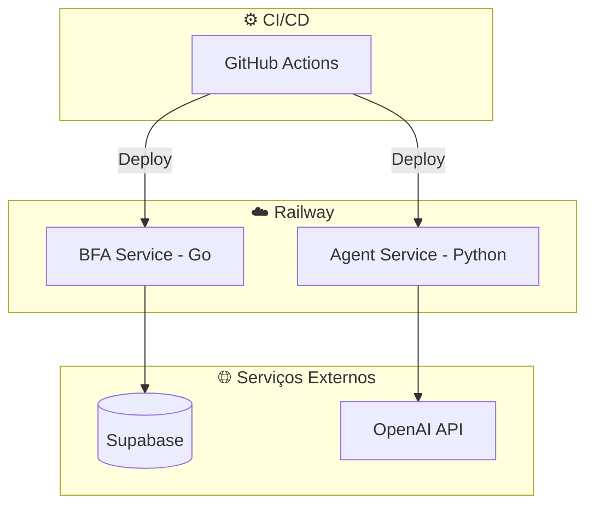

# DevOps & Infraestrutura

:::info Em construção
Conteúdo detalhado será adicionado em breve.
:::

## Infraestrutura

## Stack de Infra

- **Docker** — containerização de todos os serviços
- **Railway** — deploy e hosting
- **GitHub Actions** — CI/CD pipelines
- **Supabase** — banco gerenciado + auth
