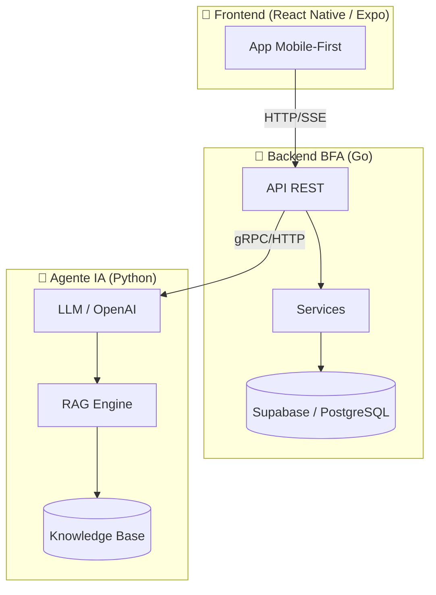

# PJ Assistant — Visão Geral

> **Assistente Bancário Inteligente para Pessoas Jurídicas** — um sistema completo com IA conversacional, integração bancária e interface mobile-first.

---

## 🎯 Objetivo

O **PJ Assistant** é um case técnico que demonstra a construção de um assistente bancário inteligente capaz de:

- 💬 **Conversar** com clientes PJ de forma natural via chat
- 🧠 **Entender contexto** usando RAG (Retrieval-Augmented Generation)
- 🏦 **Executar operações bancárias** (Pix, extratos, boletos, etc.)
- 📱 **Funcionar** em uma interface mobile-first moderna

---

## 🏗️ Arquitetura de Alto Nível

---

## 🧩 Stack Tecnológica

| Camada | Tecnologia | Descrição |
|--------|-----------|-----------|
| **Frontend** | React Native + Expo | App mobile-first com TypeScript |
| **Backend** | Go (Golang) | API REST de alta performance |
| **Agente IA** | Python + LangChain | Motor conversacional com RAG |
| **Banco de Dados** | Supabase (PostgreSQL) | Persistência e auth |
| **Vector Store** | ChromaDB | Embeddings para RAG |
| **Infra** | Docker + Railway | Containerização e deploy |

---

## 📦 Repositórios

| Repo | Descrição |
|------|-----------|
| [`pj-assistant-web`](https://github.com/Boddenberg/pj-assistant-web) | Frontend React Native / Expo |
| [`pj-assistant-bfa-go`](https://github.com/Boddenberg/pj-assistant-bfa-go) | Backend Go — API bancária |
| [`pj-assistant-agent-py`](https://github.com/Boddenberg/pj-assistant-agent-py) | Agente IA Python — RAG + LLM |
| [`pj-assistant-case-docs`](https://github.com/Boddenberg/pj-assistant-case-docs) | Esta documentação (Docusaurus) |

---

:::tip Navegação
Use a **sidebar** à esquerda para explorar cada camada do sistema em detalhe.
:::
